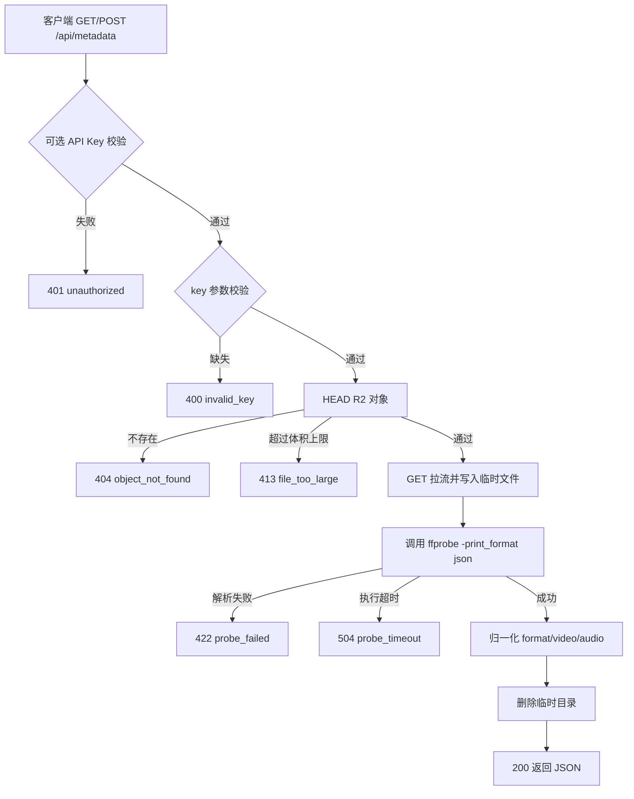

# MetaParse（Go 版）

基于 **Go 标准库 + ffmpeg/ffprobe** 的媒体元数据解析服务。

对外提供 HTTP 接口：从 **Cloudflare R2** 读取媒体文件，调用 **ffprobe** 解析元数据并 **同步返回 JSON**。所有请求均输出结构化日志（含耗时、文件体积与类型），便于排查问题。同时内置一个静态演示页，方便手动调试。

> 本项目是 [TimeOfPassage/metaparse](https://github.com/TimeOfPassage/metaparse)（TypeScript + SvelteKit）的 Go 语言实现，接口与行为保持一致。

## 目录

- 与原项目的对应关系
- 技术栈
- 请求处理流程
- 特性
- 目录结构
- 快速开始
- 环境变量
- API
- 实现说明
- 测试与验证
- 已知限制与后续计划

## 与原项目的对应关系

保留原项目的模块划分、接口契约与错误码，仅更换语言与运行时：

| 原项目（TypeScript） | 本项目（Go） |
| --- | --- |
| `src/lib/server/config.ts` | `internal/config/config.go` |
| `src/lib/server/errors.ts` | `internal/apperr/apperr.go` |
| `src/lib/server/logger.ts` | `internal/logging/logging.go` |
| `src/lib/server/exec.ts` | `internal/execx/exec.go` |
| `src/lib/server/http.ts` | `internal/api/httpx.go` |
| `src/lib/server/mime.ts` | `internal/mimetype/mime.go` |
| `src/lib/server/r2.ts` | `internal/r2/r2.go` + `internal/r2/sigv4.go` |
| `src/lib/server/ffprobe.ts` | `internal/ffprobe/ffprobe.go` |
| `src/lib/server/temp.ts` | `internal/tempfile/temp.go` |
| `src/lib/server/metadata.ts` | `internal/metadata/`（`metadata.go` + `normalize.go`） |
| `src/routes/api/metadata/+server.ts` | `internal/api/handlers.go` |
| `src/routes/api/health/+server.ts` | `internal/api/handlers.go` |
| `src/routes/+page.svelte` | `internal/webui/index.html`（`go:embed`） |

主要差异：

- **零第三方依赖**：原项目用 `@aws-sdk/client-s3` 访问 R2；本项目用标准库实现 AWS Signature V4 签名，产出单一静态二进制（仅运行期依赖系统 `ffprobe`）。
- **演示页**：由 Svelte 5 组件改为单文件静态页，经 `go:embed` 内嵌，无需前端构建步骤。
- **临时目录前缀**：仍由 `TEMP_DIR_PREFIX` 控制。

## 技术栈

| 层 | 选型 |
| --- | --- |
| 语言 | Go 1.22+（仅标准库） |
| HTTP | `net/http`（Go 1.22 方法路由 `GET /api/...`） |
| 元数据解析 | ffmpeg / ffprobe |
| 对象存储 | Cloudflare R2（S3 兼容，自实现 SigV4） |

## 请求处理流程



## 特性

- **同步解析**：`ffprobe -print_format json` 获取 `format` / `streams` / `chapters`，并归一化出常用字段（时长、码率、分辨率、帧率、编解码等）
- **容错解析**：非视频/图片/音频文件（含无法被 ffprobe 解析的文件）不报错，按成功返回，且仅返回文件体积/类型等 `source` 信息
- **结构化日志**：每个请求输出单行 JSON（方法、路径、状态码、耗时、请求 ID）；解析各阶段耗时与**文件体积、类型**也一并记录
- **耗时可见**：响应体含 `timings`（HEAD / 下载 / 解析 / 总耗时），便于定位瓶颈
- **大文件保护**：先 `HEAD` 判断体积，超过 `MAX_FILE_BYTES` 直接拒绝；下载过程中再次限流兜底
- **超时控制**：单次 ffprobe 超过 `PROBE_TIMEOUT_MS` 会被强制终止
- **结构化错误**：统一 `{ error: { code, message, details } }`，便于调用方按 `code` 处理
- **可选鉴权**：设置 `API_KEY` 后所有接口需携带密钥
- **健康检查**：`/api/health` 报告 ffprobe 可用性与 R2 配置状态，供容器健康检查使用
- **只接受 R2 key**：不接收任意 URL，天然规避 SSRF
- **容器化**：提供 `Dockerfile`（多阶段、内置 ffmpeg）与 `docker-compose.yaml`
- **单二进制**：`CGO_ENABLED=0` 静态编译，零第三方依赖

## 目录结构

```
.
├── Dockerfile
├── docker-compose.yaml
├── .env.example
├── cmd/
│   └── server/main.go            # 入口：启动服务 / healthcheck 子命令
├── internal/
│   ├── apperr/apperr.go          # 带 HTTP 状态语义的 AppError
│   ├── config/config.go          # 运行时配置与必填校验
│   ├── logging/logging.go        # 结构化 JSON 日志
│   ├── execx/exec.go             # 子进程执行封装（超时 / ENOENT 处理）
│   ├── keyutil/keyutil.go        # key 规范化与扩展名推断
│   ├── mimetype/mime.go          # 由扩展名推断 MIME 类型
│   ├── r2/
│   │   ├── r2.go                 # R2（S3 兼容）访问层
│   │   └── sigv4.go              # AWS Signature V4 签名
│   ├── ffprobe/ffprobe.go        # ffprobe 子进程封装
│   ├── tempfile/temp.go          # 临时文件下载、限流与清理
│   ├── metadata/
│   │   ├── types.go              # 响应类型
│   │   ├── normalize.go          # ffprobe 输出归一化
│   │   └── metadata.go           # 解析编排
│   ├── webui/                    # go:embed 演示页
│   └── api/                      # 路由、鉴权、错误响应、请求日志
└── scripts/smoke.sh              # 冒烟测试
```

## 快速开始

### 方式一：Docker（推荐，镜像自带 ffmpeg）

```sh
cp .env.example .env      # 填入 R2 凭据
docker compose up --build -d
# 打开 http://localhost:3000
```

### 方式二：本地运行

前置条件：
- Go 1.22+
- 本机安装 ffmpeg（需包含 `ffprobe`）：`brew install ffmpeg` / `apt install ffmpeg`

```sh
cp .env.example .env      # 填入 R2 凭据（可留空，先跑通健康检查与错误响应）
go run ./cmd/server       # 默认监听 http://0.0.0.0:3000
```

构建与运行：

```sh
go build -o resparse ./cmd/server
./resparse
```

### 常用命令

| 命令 | 说明 |
| --- | --- |
| `go run ./cmd/server` | 本地运行 |
| `go build -o resparse ./cmd/server` | 构建二进制 |
| `go vet ./...` | 静态检查 |
| `go test ./...` | 单元测试（含受保护的端到端测试） |
| `sh scripts/smoke.sh` | 冒烟测试（构建并请求接口，无需 R2 凭据） |

## 环境变量

| 变量 | 必填 | 默认 | 说明 |
| --- | --- | --- | --- |
| `R2_ACCOUNT_ID` | 是 | — | Cloudflare 账号 ID |
| `R2_ACCESS_KEY_ID` | 是 | — | R2 S3 兼容 Access Key ID |
| `R2_SECRET_ACCESS_KEY` | 是 | — | R2 S3 兼容 Secret Access Key |
| `R2_BUCKET` | 是 | — | R2 存储桶名 |
| `R2_ENDPOINT` | 否 | `https://<account>.r2.cloudflarestorage.com` | 自定义 endpoint |
| `R2_REGION` | 否 | `auto` | R2 固定用 `auto` |
| `API_KEY` | 否 | 空 | 设置后所有 `/api/*` 需携带该密钥 |
| `FFPROBE_PATH` | 否 | `ffprobe` | ffprobe 可执行文件路径 |
| `PROBE_TIMEOUT_MS` | 否 | `30000` | 单次解析超时（毫秒） |
| `LOG_LEVEL` | 否 | `info` | 日志级别：`debug` / `info` / `warn` / `error` |
| `MAX_FILE_BYTES` | 否 | `2147483648`（2 GiB） | 允许解析的最大文件体积 |
| `TEMP_DIR_PREFIX` | 否 | `metaparse-` | 临时目录前缀 |
| `PORT` / `HOST` | 否 | `3000` / `0.0.0.0` | 监听地址 |

获取 R2 凭据：Cloudflare Dashboard → R2 → **Manage R2 API Tokens** → 创建具备对象 **读取**权限的 S3 兼容凭据。

未配置 R2 时服务仍可启动：页面可访问，调用解析接口会返回 `config_missing`，便于本地无凭据调试。

## API

### 解析元数据

| 方法 | 说明 |
| --- | --- |
| `GET /api/metadata?key=<r2-object-key>` | 通过查询参数传入 key |
| `POST /api/metadata` | body：`{"key":"..."}`，或纯文本 key |

```sh
# GET
curl "http://localhost:3000/api/metadata?key=videos/demo.mp4"

# POST（JSON）
curl -X POST http://localhost:3000/api/metadata \
  -H 'content-type: application/json' \
  -d '{"key":"videos/demo.mp4"}'
```

若设置了 `API_KEY`，需携带其一：

```
Authorization: Bearer <API_KEY>
x-api-key: <API_KEY>
```

**成功响应**（200，节选）：

```json
{
  "source": {
    "type": "r2",
    "bucket": "my-bucket",
    "key": "videos/demo.mp4",
    "sizeBytes": 1234567,
    "contentType": "video/mp4",
    "etag": "\"...\"",
    "lastModified": "2026-10-04T00:00:00.000Z"
  },
  "format": {
    "formatName": "mov,mp4,m4a,3gp,3g2,mj2",
    "formatLongName": "QuickTime / MOV",
    "durationSeconds": 12.34,
    "sizeBytes": 1234567,
    "bitRate": 800000,
    "tags": {}
  },
  "video": { "index": 0, "codec": "h264", "width": 1920, "height": 1080, "frameRate": 29.97, "bitRate": 750000 },
  "audio": { "index": 1, "codec": "aac", "sampleRate": 48000, "channels": 2, "channelLayout": "stereo" },
  "subtitles": 0,
  "streams": [],
  "chapters": [],
  "probe": { "durationMs": 132, "ffprobeVersion": "ffprobe version 7.x" },
  "timings": { "headMs": 18, "downloadMs": 640, "probeMs": 132, "totalMs": 795 },
  "raw": { "streams": [], "format": {} }
}
```

**响应字段**

| 字段 | 说明 |
| --- | --- |
| `source` | 来源信息（bucket / key / 体积 / Content-Type / ETag / 修改时间） |
| `format` | 容器信息：格式名、时长（秒）、体积、总码率、容器标签 |
| `video` | 第一条视频流（排除封面图）归一化结果，无则为 `null` |
| `audio` | 第一条音频流归一化结果，无则为 `null` |
| `subtitles` | 字幕流数量 |
| `streams` | ffprobe 原始流列表 |
| `chapters` | 章节列表 |
| `probe` | 解析耗时与 ffprobe 版本 |
| `timings` | 各阶段耗时（`headMs` / `downloadMs` / `probeMs` / `totalMs`） |
| `raw` | ffprobe 原始 JSON 输出（便于取用未归一化字段） |

归一化时把 `"30000/1001"` 之类的分数帧率、字符串数字统一转换为 `number`。

`source.sizeBytes` 与 `source.contentType` 始终返回：体积取 R2 HEAD 值，缺失时回退到实际下载字节数；Content-Type 缺失时按 key 扩展名推断，无法推断则用 `application/octet-stream`。

**非视频/图片/音频文件：仅返回 `source`，并按成功（200）处理。** 例如 `README.md` 返回：

```json
{
  "source": {
    "type": "r2",
    "bucket": "my-bucket",
    "key": "README.md",
    "sizeBytes": 12345,
    "contentType": "application/octet-stream",
    "etag": "\"...\"",
    "lastModified": "2026-10-04T00:00:00.000Z"
  }
}
```

判定方式：ffprobe 解析成功且存在 video/audio 流（图片会被 ffprobe 归为 video 流）则为媒体文件；否则（含 ffprobe 解析失败）仅返回 `source`。超时、ffprobe 缺失等仍按对应 HTTP 错误返回。

**错误响应**

```json
{
  "error": {
    "code": "object_not_found",
    "message": "R2 中不存在对象：videos/demo.mp4",
    "details": {}
  }
}
```

| HTTP | `code` | 说明 |
| --- | --- | --- |
| 400 | `invalid_key` | 缺少 `key` |
| 401 | `unauthorized` | API Key 校验失败 |
| 404 | `object_not_found` | R2 中对象不存在 |
| 413 | `file_too_large` | 超过 `MAX_FILE_BYTES` |
| 500 | `config_missing` | 缺少 R2 配置 |
| 500 | `ffprobe_not_found` | 找不到 ffprobe 可执行文件 |
| 500 | `internal_error` | 其他未预期错误 |
| 502 | `r2_error` | 访问 R2 失败 |
| 504 | `probe_timeout` | ffprobe 超时 |

### 请求日志

所有 `/api/metadata` 请求都会输出单行 JSON 日志（`LOG_LEVEL` 控制级别），可用 `requestId` 串联同一次请求：

```json
{"method":"GET","path":"/api/metadata","query":{"key":"videos/demo.mp4"},"requestId":"...","level":"info","msg":"http.request","ts":"..."}
{"key":"videos/demo.mp4","sizeBytes":1234567,"contentType":"video/mp4","timings":{"headMs":18,"downloadMs":640,"probeMs":132,"totalMs":795},"level":"info","msg":"metadata.parsed","ts":"..."}
{"method":"GET","path":"/api/metadata","status":200,"durationMs":810,"level":"info","msg":"http.response","ts":"..."}
```

- 请求开始（`http.request`）与结束（`http.response`）均含 `requestId`；响应头 `x-request-id` 回传同一 ID。
- 4xx 记 `warn`、5xx 记 `error`，并在 `http.response` 中附带 `error.code`。
- 业务日志 `metadata.parsed`（媒体文件）/ `metadata.source_only`（非媒体，日志中附 `probeError`）均包含**文件体积、类型**与各阶段 `timings`。

### 健康检查

```sh
GET /api/health
```

返回进程存活、ffprobe 可用性与 R2 配置状态：

```json
{
  "status": "ok",
  "checks": {
    "ffprobe": { "ok": true, "path": "ffprobe", "version": "ffprobe version 7.x" },
    "r2": { "configured": true }
  },
  "limits": { "maxFileBytes": 2147483648, "probeTimeoutMs": 30000 },
  "uptimeSeconds": 12
}
```

`status` 取值：`ok`（ffprobe 可用且 R2 已配置）/ `degraded`（ffprobe 可用但 R2 未配置）/ `unhealthy`（ffprobe 不可用，返回 `503`）。

## 实现说明

### 为什么手写 SigV4

原项目依赖 `@aws-sdk/client-s3`。R2 仅需 GET / HEAD 两类无 body 请求，`internal/r2/sigv4.go` 用标准库实现 AWS Signature V4 即可覆盖，从而避免引入庞大的 SDK 依赖，产出单二进制。签名逻辑用 AWS 官方测试向量做了单元校验（见 `internal/r2/sigv4_test.go`）。

对象以 **path-style** 寻址：`https://<endpoint>/<bucket>/<key>`。为保证签名中的 CanonicalURI 与真正发送的请求目标一致，构造请求时同时设置 `URL.Path` 与 `URL.RawPath`，签名取 `URL.EscapedPath()`。

### 解析为什么先落盘

ffprobe 直接读取本地文件最稳妥（可随机 seek），因此从 R2 拉流时先写入临时目录（`os.TempDir()` 下以 `TEMP_DIR_PREFIX` 为前缀的目录），解析完成后无论成功与否都会递归删除。下载过程中通过 `io.LimitedReader` 做体积限流，超出即中断并返回 413。

### 子进程与信号

ffprobe 通过 `exec.CommandContext` 执行：超时由 context 触发强杀；`exec.ErrNotFound`（ENOENT）映射为 `ffprobe_not_found`。容器内由 `tini` 转发信号并回收子进程。

## 测试与验证

```sh
gofmt -l .         # 格式检查（应为空）
go vet ./...       # 静态检查
go test ./...      # 单元测试
sh scripts/smoke.sh  # 冒烟测试：构建并请求 /api/health、/api/metadata
```

- **单元测试**：key 规范化与扩展名、MIME 推断、SigV4（AWS 官方向量）、ffprobe 输出归一化、临时文件限流。
- **端到端测试**（`internal/metadata/integration_test.go`）：用纯 Go 构造 WAV，`httptest` 模拟 R2，走完 `HEAD → GET → 落盘 → ffprobe → 归一化`。**仅在存在 `ffprobe` 时运行**，否则自动跳过。
- **冒烟测试**（`scripts/smoke.sh`）：无需真实 R2 凭据，验证结构化 `config_missing` / `invalid_key` 错误与健康检查；未安装 ffmpeg 时 `/api/health` 返回 `503`，脚本仍视为通过。

## 已知限制与后续计划

- **仅支持 R2 源**：架构已按「来源 → 落盘 → 探测」拆分，后续可扩展 HTTP URL、直传上传等来源
- **不走流式解析**：需完整下载到临时目录，超大文件会占用磁盘与时间（已有体积上限保护）
- **无缓存与限流**：未做结果缓存与并发控制，如需可接入 Redis 缓存或请求队列
- **多流选择简化**：`video` / `audio` 字段仅返回第一条对应流（视频排除封面图），完整信息见 `streams` / `raw`
- **同步返回**：大文件解析会占用连接较长时间，后续可增加异步任务 + 回调/轮询模式
